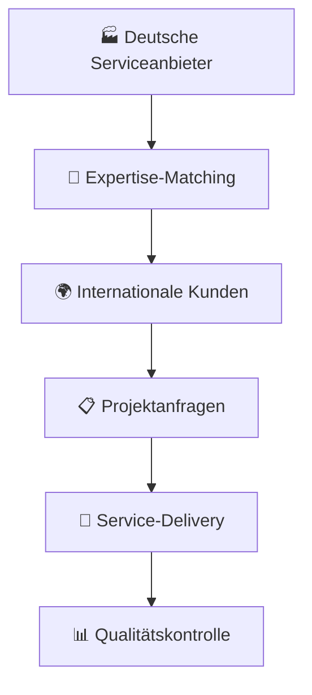
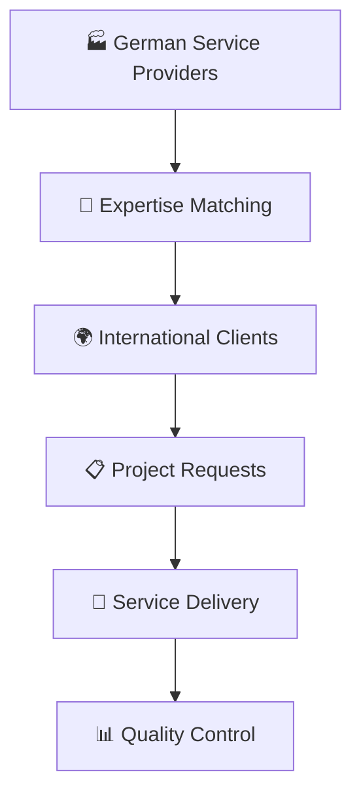

# 🇩🇪 MADE-IN-GERMANY-SERVICES - Initiator & Gründer: <br> Andreas Thommen (Hansestadt Bremen, 1972) 

<div align="center">

```ascii
███╗   ███╗ █████╗ ██████╗ ███████╗    ██╗███╗   ██╗     ██████╗ ███████╗██████╗ ███╗   ███╗ █████╗ ███╗   ██╗██╗   ██╗
████╗ ████║██╔══██╗██╔══██╗██╔════╝    ██║████╗  ██║    ██╔════╝ ██╔════╝██╔══██╗████╗ ████║██╔══██╗████╗  ██║╚██╗ ██╔╝
██╔████╔██║███████║██║  ██║█████╗      ██║██╔██╗ ██║    ██║  ███╗█████╗  ██████╔╝██╔████╔██║███████║██╔██╗ ██║ ╚████╔╝ 
██║╚██╔╝██║██╔══██║██║  ██║██╔══╝      ██║██║╚██╗██║    ██║   ██║██╔══╝  ██╔══██╗██║╚██╔╝██║██╔══██║██║╚██╗██║  ╚██╔╝  
██║ ╚═╝ ██║██║  ██║██████╔╝███████╗    ██║██║ ╚████║    ╚██████╔╝███████╗██║  ██║██║ ╚═╝ ██║██║  ██║██║ ╚████║   ██║   
╚═╝     ╚═╝╚═╝  ╚═╝╚═════╝ ╚══════╝    ╚═╝╚═╝  ╚═══╝     ╚═════╝ ╚══════╝╚═╝  ╚═╝╚═╝     ╚═╝╚═╝  ╚═╝╚═╝  ╚═══╝   ╚═╝   
```


[](https://made-in-germany.global)
[]()
[]()
[]()

**🎯 Deutsche Service-Exzellenz mit internationalen Märkten verbinden**

### 🚀 Gegründet von Visionär | Andreas Thommen
*Service-Pionier & Plattform-Architekt | Geboren 1972, Bremen, Deutschland*

</div>

---

## 🌐 Verbinden Sie sich mit uns

[](https://linkedin.com/company/made-in-germany) 
[](https://twitter.com/made_in_germany) 
[](https://made-in-germany.global)
[](https://github.com/made-in-germany-global)
[](mailto:made-in-germany.tommen@made-in-germany.global)

---

## 🌟 Willkommen zu unserem Repository: Made in Germany Services

Willkommen zu unserem Repository „Made in Germany Produkte“! Deutschland ist weltweit bekannt für seine herausragende Qualität, Präzision und Innovationskraft. Die Marke „Made in Germany“ steht für zuverlässige Produkte, technologische Exzellenz und eine lange Tradition im Ingenieurwesen. In diesem Repository möchten wir einen umfassenden Überblick über die wichtigsten Branchen, Produktkategorien und Hersteller bieten, die die Stärke deutscher Produkte ausmachen.

Die deutsche Industrie ist vielfältig: vom Automobilbau über Maschinenbau, Elektrotechnik, Chemie und Pharma bis hin zu Lebensmittel-, Getränke- und Textilindustrie. Jede Branche hat ihre eigenen Highlights, die Deutschland weltweit wettbewerbsfähig machen. Ziel dieses Repositories ist es, die wichtigsten Hersteller, ihre Produkte und die jeweiligen Kategorien transparent darzustellen, um die Sichtbarkeit von Made-in-Germany-Produkten online zu erhöhen.

Dieses Repository richtet sich an internationale Geschäftspartner, Investoren, Exportinteressierte und alle, die sich für deutsche Produkte und deren Qualität interessieren. Die detaillierte Übersicht der Branchen und Hersteller bietet wertvolle Informationen über die Vielfalt der deutschen Industrie und die Möglichkeiten, die sich durch Made-in-Germany-Produkte ergeben.

Deutschland steht für Präzision, Qualität und Verlässlichkeit. Made-in-Germany-Produkte sind weltweit gefragt und stehen für Vertrauen, Langlebigkeit und Innovation. Dieses Repository zeigt, wie breit gefächert die deutsche Industrie ist und welche Hersteller in welchen Produktkategorien aktiv sind.
. Von Ingenieur- und Beratungsleistungen über Logistik, Qualitätsmanagement bis hin zu Exportunterstützung bieten deutsche Dienstleister unvergleichliche Professionalität, Präzision und Zuverlässigkeit.

### 🎯 Mission & Vision

<table>
<tr>
<td width="50%">

#### 🌍 Internationaler Überblick
- **Detaillierte Einblicke** in verschiedene Dienstleistungssektoren
- **Unternehmen und Servicekategorien** die zur internationalen Reputation beitragen
- **Klares Verständnis** der Breite und Tiefe deutscher Serviceleistungen

</td>
<td width="50%">

#### 🔍 Unser Ziel
Als internationalem Einkäufer, Distributor oder Partner bieten wir Ihnen umfassende Orientierung im Bereich industrielle Beratung, technischer Support, IT-Dienstleistungen, Projektmanagement und Prozessoptimierung.

</td>
</tr>
</table>

---

## 🚀 **Service-Portfolio & Expertise**

<div align="center">


</div>

---

### 🌐 Service-Ökosystem



### ⚡ Service-Kategorien

| Service | Expertise | Auswirkung |
|---------|-----------|-----------|
| 🔄 **Made-in-Germany-Consulting** | Industrielle Beratung | Strategische Geschäftslösungen |
| 🔧 **Made-in-Germany-Engineering** | Technische Lösungen | Präzise Ingenieursleistungen |
| 🚛 **Made-in-Germany-Logistics** | Supply Chain Management | Globale Logistiklösungen |
| ⭐ **Made-in-Germany-Quality** | Qualitätsmanagement | Höchste Standards |
| 🎓 **Made-in-Germany-Training** | Technische Schulungen | Kompetenzentwicklung |
| 🔍 **Made-in-Germany-ProcessOptimization** | Effizienzsteigerung | Operative Exzellenz |

---

## 🏭 Service-Sektoren | Deutsche Professionalität

<details>
<summary>🔧 <strong>Technische Beratung & Engineering</strong></summary>

Umfassende Ingenieur- und Beratungsleistungen, die internationale Standards für technische Exzellenz und Innovation definieren.
</details>

<details>
<summary>📋 <strong>Projektmanagement & Support</strong></summary>

Professionelles Projektmanagement und technischer Support, der komplexe internationale Projekte zum Erfolg führt.
</details>

<details>
<summary>🚛 <strong>Logistik & Supply Chain</strong></summary>

Erstklassige Logistiklösungen und Supply Chain Management, die globale Handelsströme optimieren.
</details>

<details>
<summary>⭐ <strong>Qualitätssicherung & Zertifizierung</strong></summary>

Umfassende Qualitätsmanagement-Services und Zertifizierungsunterstützung nach internationalen Standards.
</details>

<details>
<summary>💻 <strong>IT-Services & Softwareunterstützung</strong></summary>

Moderne IT-Dienstleistungen und Softwarelösungen, die digitale Transformation vorantreiben.
</details>

---

## 🌍 Übersicht der Services - 50+ Keywords

### 🏆 Kern-Services

```
Made-in-Germany-Services          Made-in-Germany-Consulting
Made-in-Germany-Engineering       Made-in-Germany-Logistics  
Made-in-Germany-Quality           Made-in-Germany-SupplyChain
Made-in-Germany-AfterSales        Made-in-Germany-Training
```

### 🌐 Spezialisierte Bereiche

#### 🔧 Technische Services
```
Made-in-Germany-TechnicalConsulting    Made-in-Germany-ProcessOptimization
Made-in-Germany-ProjectManagement      Made-in-Germany-IndustrialServices  
Made-in-Germany-EngineeringSolutions   Made-in-Germany-ProcessEngineering
```

#### 🌍 Internationale Unterstützung
```
Made-in-Germany-ExportSupport         Made-in-Germany-InternationalTrade
Made-in-Germany-GlobalTradeSupport    Made-in-Germany-DistributionServices
Made-in-Germany-ExportManagement      Made-in-Germany-CertificationSupport
```

#### 💼 Business Support
```
Made-in-Germany-B2BServices           Made-in-Germany-BusinessSupport
Made-in-Germany-ManufacturingSupport  Made-in-Germany-ProductionSupport
Made-in-Germany-IndustrialConsulting  Made-in-Germany-TechnicalSolutions
```

### 🚀 Erweiterte Services

```
Made-in-Germany-ITServices            Made-in-Germany-SoftwareSupport
Made-in-Germany-Reliability           Made-in-Germany-Expertise
Made-in-Germany-Solutions             Made-in-Germany-TechnicalTraining
Made-in-Germany-AfterSalesSupport     Made-in-Germany-IndustryExperts
Made-in-Germany-PartnerServices       Made-in-Germany-EngineeringConsulting
Made-in-Germany-BusinessSolutions     Made-in-Germany-ITSupport
Made-in-Germany-ServiceProviders      Made-in-Germany-ProcessSolutions
Made-in-Germany-ProductionOptimization Made-in-Germany-IndustrialExpertise
Made-in-Germany-GlobalPartners        Made-in-Germany-TradeSolutions
Made-in-Germany-B2BExperts            Made-in-Germany-LogisticsSolutions
Made-in-Germany-ProjectSupport        Made-in-Germany-QualityAssurance
Made-in-Germany-IndustrialSolutions   Made-in-Germany-IndustrySupport
```

---

## 📊 Service-Performance-Metriken


### 📈 Service-Statistiken


### 🎯 Service-Verteilung


---

## 🌟 Service-Exzellenz-Architektur

```yaml
🔹 Service-Transformation:
  - Automatisierte Service-Workflows
  - Echtzeit-Qualitätsmonitoring  
  - Prädiktive Service-Analysen
  - Blockchain-verifizierte Serviceleistungen

🔹 Globale Service-Skalierbarkeit:
  - Mehrsprachiges Service-System
  - Regionale Compliance-Automatisierung
  - Kulturelle Service-Anpassung
  - Zeitzonen-optimierte Operations

🔹 Intelligente Service-Schicht:
  - KI-gestütztes Service-Matching
  - Automatisierte Qualitätsbewertung
  - Prädiktive Service-Planung
  - Dynamische Ressourcenoptimierung
```

---

## 🚀 Service-Zugang | Werden Sie Teil unseres Netzwerks

### Für Serviceempfänger 🏭
1. **Entdecken** → Erkunden Sie unsere umfassenden Service-Kategorien
2. **Anfragen** → Spezifizieren Sie Ihre Service-Anforderungen
3. **Erhalten** → Professionelle deutsche Serviceleistungen

### Für Serviceanbieter 🌍  
1. **Registrieren** → Präsentieren Sie Ihre Service-Expertise
2. **Qualifizieren** → Durchlaufen Sie unseren Qualitätsprozess
3. **Liefern** → Erbringen Sie erstklassige Services

### Für Partner 🤝
1. **Kooperieren** → Werden Sie Teil unseres Service-Netzwerks
2. **Integrieren** → Nutzen Sie unsere Service-Infrastruktur  
3. **Expandieren** → Skalieren Sie mit bewährten Service-Standards

---

## 📊 GitHub-Statistiken

<div align="center">

<table>
<tr>
<td width="50%">


</td>
<td width="50%">


</td>
</tr>
</table>

</div>

---

## 🎖️ Unser Service-Einfluss

<div align="center">

| 🌍 **Globale Service-Reichweite** | 🔧 **Service-Bereiche** | 🤝 **Service-Partnerschaften** | 📈 **Service-Wachstum** |
|:-------------------:|:------------------------:|:-------------------:|:-------------:|
| 50+ Service-Kategorien | Technische Beratung | B2B-Service-Plattformen | Exponentiell |
| 5+ Kontinente | Engineering | Export-Service-Agenturen | Strategisch |
| 15+ Sprachen | Qualitätsmanagement | Handels-Service-Organisationen | Nachhaltig |

</div>

---

## 🏆 Fazit und Kontakt

Die Service-Exzellenz deutscher Unternehmen ist ein zentraler Pfeiler ihrer weltweiten Reputation. Die strukturierten, verlässlichen und qualitativ hochwertigen Dienstleistungen sorgen für reibungslose internationale Zusammenarbeit und erfolgreiche Geschäftsergebnisse. Ob technisches Consulting, Ingenieursleistungen, Logistik oder Full-Service-Lösungen – Deutschland bietet Partner, die mit Präzision und Professionalität liefern.

Dieses Repository dient als Ihr Leitfaden zum Verständnis und zur Nutzung der breiten Palette deutscher Serviceleistungen. Durch die Erkundung der hier aufgeführten Sektoren und Keywords können Sie potenzielle Partner identifizieren, Best Practices kennenlernen und wertvolle Einblicke in die Arbeitsweise deutscher Unternehmen auf globaler Ebene erhalten.

<div align="center">

🌐 **Website:** [made-in-germany.global](https://made-in-germany.global)

📧 **Kontakt:** made-in-germany.tommen@made-in-germany.global

[](mailto:made-in-germany.tommen@made-in-germany.global)

🔮 **Service 4.0 Bereit** | **Qualitäts-Gestützt** | **Globaler Maßstab**


</div>

---

## 🏆 Service-Exzellenz-Abzeichen

<div align="center">


</div>

---

<div align="center">


### 🌟 **"Deutsche Service-Exzellenz weltweit stärken"** 🌟

**🔧 Mit Service-Leidenschaft und Professionalität gebaut | Globale Service-Märkte verbinden 🌎**

*Ihr Leitfaden für erstklassige deutsche Serviceangebote*

**🌟 Angetrieben von deutscher Service-Exzellenz 🌟**

</div>

---

# 🇪🇳 MADE-IN-GERMANY-SERVICES - Initiator & Founder: <br> Andreas Thommen (Hanseatic City of Bremen, 1972) 

<div align="center">

```ascii
███╗   ███╗ █████╗ ██████╗ ███████╗    ██╗███╗   ██╗     ██████╗ ███████╗██████╗ ███╗   ███╗ █████╗ ███╗   ██╗██╗   ██╗
████╗ ████║██╔══██╗██╔══██╗██╔════╝    ██║████╗  ██║    ██╔════╝ ██╔════╝██╔══██╗████╗ ████║██╔══██╗████╗  ██║╚██╗ ██╔╝
██╔████╔██║███████║██║  ██║█████╗      ██║██╔██╗ ██║    ██║  ███╗█████╗  ██████╔╝██╔████╔██║███████║██╔██╗ ██║ ╚████╔╝ 
██║╚██╔╝██║██╔══██║██║  ██║██╔══╝      ██║██║╚██╗██║    ██║   ██║██╔══╝  ██╔══██╗██║╚██╔╝██║██╔══██║██║╚██╗██║  ╚██╔╝  
██║ ╚═╝ ██║██║  ██║██████╔╝███████╗    ██║██║ ╚████║    ╚██████╔╝███████╗██║  ██║██║ ╚═╝ ██║██║  ██║██║ ╚████║   ██║   
╚═╝     ╚═╝╚═╝  ╚═╝╚═════╝ ╚══════╝    ╚═╝╚═╝  ╚═══╝     ╚═════╝ ╚══════╝╚═╝  ╚═╝╚═╝     ╚═╝╚═╝  ╚═╝╚═╝  ╚═══╝   ╚═╝   
```


[](https://made-in-germany.global)
[]()
[]()
[]()

**🎯 Connecting German Service Excellence with International Markets**

### 🚀 Founded by Visionary | Andreas Thommen
*Service Pioneer & Platform Architect | Born 1972, Bremen, Germany*

</div>

---

## 🌐 Connect With Us

[](https://linkedin.com/company/made-in-germany) 
[](https://twitter.com/made_in_germany) 
[](https://made-in-germany.global)
[](https://github.com/made-in-germany-global)
[](mailto:made-in-germany.tommen@made-in-germany.global)

---

## 🌟 Welcome to our Repository: Made in Germany Services

This repository is designed to provide an in-depth overview of the wide-ranging services and expertise that German companies offer to international markets. Germany is globally recognized not only for its high-quality products but also for its exceptional service infrastructure that supports businesses worldwide. From engineering and consulting to logistics, quality assurance, and export support, German service providers offer unmatched professionalism, precision, and reliability.

### 🎯 Mission & Vision

<table>
<tr>
<td width="50%">

#### 🌍 International Overview
- **Detailed insights** into various service sectors
- **Companies and service categories** contributing to international reputation
- **Clear understanding** of German service breadth and depth

</td>
<td width="50%">

#### 🔍 Our Goal
As an international buyer, distributor, or partner, we provide comprehensive guidance in industrial consulting, technical support, IT services, project management, and process optimization.

</td>
</tr>
</table>

---

## 🚀 **Service Portfolio & Expertise**

<div align="center">


</div>

---

### 🌐 Service Ecosystem



### ⚡ Service Categories

| Service | Expertise | Impact |
|---------|-----------|--------|
| 🔄 **Made-in-Germany-Consulting** | Industrial Consulting | Strategic Business Solutions |
| 🔧 **Made-in-Germany-Engineering** | Technical Solutions | Precision Engineering Services |
| 🚛 **Made-in-Germany-Logistics** | Supply Chain Management | Global Logistics Solutions |
| ⭐ **Made-in-Germany-Quality** | Quality Management | Highest Standards |
| 🎓 **Made-in-Germany-Training** | Technical Training | Competency Development |
| 🔍 **Made-in-Germany-ProcessOptimization** | Efficiency Enhancement | Operational Excellence |

---

## 🏭 Service Sectors | German Professionalism

<details>
<summary>🔧 <strong>Technical Consulting & Engineering</strong></summary>

Comprehensive engineering and consulting services that define international standards for technical excellence and innovation.
</details>

<details>
<summary>📋 <strong>Project Management & Support</strong></summary>

Professional project management and technical support that leads complex international projects to success.
</details>

<details>
<summary>🚛 <strong>Logistics & Supply Chain</strong></summary>

First-class logistics solutions and supply chain management that optimize global trade flows.
</details>

<details>
<summary>⭐ <strong>Quality Assurance & Certification</strong></summary>

Comprehensive quality management services and certification support according to international standards.
</details>

<details>
<summary>💻 <strong>IT Services & Software Support</strong></summary>

Modern IT services and software solutions that drive digital transformation.
</details>

---

## 🌍 Service Overview - 50+ Keywords

### 🏆 Core Services

```
Made-in-Germany-Services          Made-in-Germany-Consulting
Made-in-Germany-Engineering       Made-in-Germany-Logistics  
Made-in-Germany-Quality           Made-in-Germany-SupplyChain
Made-in-Germany-AfterSales        Made-in-Germany-Training
```

### 🌐 Specialized Areas

#### 🔧 Technical Services
```
Made-in-Germany-TechnicalConsulting    Made-in-Germany-ProcessOptimization
Made-in-Germany-ProjectManagement      Made-in-Germany-IndustrialServices  
Made-in-Germany-EngineeringSolutions   Made-in-Germany-ProcessEngineering
```

#### 🌍 International Support
```
Made-in-Germany-ExportSupport         Made-in-Germany-InternationalTrade
Made-in-Germany-GlobalTradeSupport    Made-in-Germany-DistributionServices
Made-in-Germany-ExportManagement      Made-in-Germany-CertificationSupport
```

#### 💼 Business Support
```
Made-in-Germany-B2BServices           Made-in-Germany-BusinessSupport
Made-in-Germany-ManufacturingSupport  Made-in-Germany-ProductionSupport
Made-in-Germany-IndustrialConsulting  Made-in-Germany-TechnicalSolutions
```

### 🚀 Extended Services

```
Made-in-Germany-ITServices            Made-in-Germany-SoftwareSupport
Made-in-Germany-Reliability           Made-in-Germany-Expertise
Made-in-Germany-Solutions             Made-in-Germany-TechnicalTraining
Made-in-Germany-AfterSalesSupport     Made-in-Germany-IndustryExperts
Made-in-Germany-PartnerServices       Made-in-Germany-EngineeringConsulting
Made-in-Germany-BusinessSolutions     Made-in-Germany-ITSupport
Made-in-Germany-ServiceProviders      Made-in-Germany-ProcessSolutions
Made-in-Germany-ProductionOptimization Made-in-Germany-IndustrialExpertise
Made-in-Germany-GlobalPartners        Made-in-Germany-TradeSolutions
Made-in-Germany-B2BExperts            Made-in-Germany-LogisticsSolutions
Made-in-Germany-ProjectSupport        Made-in-Germany-QualityAssurance
Made-in-Germany-IndustrialSolutions   Made-in-Germany-IndustrySupport
```
# 🇺🇸 MADE-IN-GERMANY-SERVICES - Initiator & Founder: <br> Andreas Thommen (Hanseatic City of Bremen, 1972) 

<div align="center">

```ascii
███╗   ███╗ █████╗ ██████╗ ███████╗    ██╗███╗   ██╗     ██████╗ ███████╗██████╗ ███╗   ███╗ █████╗ ███╗   ██╗██╗   ██╗
████╗ ████║██╔══██╗██╔══██╗██╔════╝    ██║████╗  ██║    ██╔════╝ ██╔════╝██╔══██╗████╗ ████║██╔══██╗████╗  ██║╚██╗ ██╔╝
██╔████╔██║███████║██║  ██║█████╗      ██║██╔██╗ ██║    ██║  ███╗█████╗  ██████╔╝██╔████╔██║███████║██╔██╗ ██║ ╚████╔╝ 
██║╚██╔╝██║██╔══██║██║  ██║██╔══╝      ██║██║╚██╗██║    ██║   ██║██╔══╝  ██╔══██╗██║╚██╔╝██║██╔══██║██║╚██╗██║  ╚██╔╝  
██║ ╚═╝ ██║██║  ██║██████╔╝███████╗    ██║██║ ╚████║    ╚██████╔╝███████╗██║  ██║██║ ╚═╝ ██║██║  ██║██║ ╚████║   ██║   
╚═╝     ╚═╝╚═╝  ╚═╝╚═════╝ ╚══════╝    ╚═╝╚═╝  ╚═══╝     ╚═════╝ ╚══════╝╚═╝  ╚═╝╚═╝     ╚═╝╚═╝  ╚═╝╚═╝  ╚═══╝   ╚═╝   
```


[](https://made-in-germany.global)
[]()
[]()
[]()

**🎯 Connecting German Service Excellence with International Markets**

### 🚀 Founded by Visionary | Andreas Thommen
*Service Pioneer & Platform Architect | Born 1972, Bremen, Germany*

</div>

---

## 🌐 Connect With Us

[](https://linkedin.com/company/made-in-germany) 
[](https://twitter.com/made_in_germany) 
[](https://made-in-germany.global)
[](https://github.com/made-in-germany-global)
[](mailto:made-in-germany.tommen@made-in-germany.global)

---

## 🌟 Welcome to our Repository: Made in Germany Services

This repository is designed to provide an in-depth overview of the wide-ranging services and expertise that German companies offer to international markets. Germany is globally recognized not only for its high-quality products but also for its exceptional service infrastructure that supports businesses worldwide. From engineering and consulting to logistics, quality assurance, and export support, German service providers offer unmatched professionalism, precision, and reliability.

In this repository, you will find detailed insights into the various service sectors in Germany, highlighting the companies and service categories that contribute to Germany's strong international reputation. Our aim is to give you, as an international buyer, distributor, or partner, a clear understanding of the breadth and depth of German services. This includes everything from industrial consulting and technical support to IT services, project management, and process optimization.

We believe that understanding German services is essential for businesses aiming to collaborate with reliable partners who follow the highest standards of quality and efficiency. Germany's expertise in organizing, managing, and delivering complex services is a key reason why businesses across the globe trust German companies. Whether you are interested in logistics, engineering consulting, or after-sales support, this repository provides a valuable resource for navigating the landscape of German service excellence.

Our goal is to offer a practical and informative guide for sourcing, partnering, and understanding the exceptional service capabilities of German companies. This repository is continuously updated to reflect the evolving service landscape, ensuring that you have the latest insights into Germany's service offerings.

### 🎯 Mission & Vision

<table>
<tr>
<td width="50%">

#### 🌍 International Overview
- **Detailed insights** into various service sectors
- **Companies and service categories** contributing to international reputation
- **Clear understanding** of German service breadth and depth

</td>
<td width="50%">

#### 🔍 Our Goal
As an international buyer, distributor, or partner, we provide comprehensive guidance in industrial consulting, technical support, IT services, project management, and process optimization.

</td>
</tr>
</table>

---

## 🚀 **Service Portfolio & Expertise**

<div align="center">


</div>

---

### 🌐 Service Ecosystem


### ⚡ Service Categories

| Service | Expertise | Impact |
|---------|-----------|--------|
| 🔄 **Made-in-Germany-Consulting** | Industrial Consulting | Strategic Business Solutions |
| 🔧 **Made-in-Germany-Engineering** | Technical Solutions | Precision Engineering Services |
| 🚛 **Made-in-Germany-Logistics** | Supply Chain Management | Global Logistics Solutions |
| ⭐ **Made-in-Germany-Quality** | Quality Management | Highest Standards |
| 🎓 **Made-in-Germany-Training** | Technical Training | Competency Development |
| 🔍 **Made-in-Germany-ProcessOptimization** | Efficiency Enhancement | Operational Excellence |

---

## 🏭 Service Sectors | German Professionalism

<details>
<summary>🔧 <strong>Technical Consulting & Engineering</strong></summary>

Comprehensive engineering and consulting services that define international standards for technical excellence and innovation.
</details>

<details>
<summary>📋 <strong>Project Management & Support</strong></summary>

Professional project management and technical support that leads complex international projects to success.
</details>

<details>
<summary>🚛 <strong>Logistics & Supply Chain</strong></summary>

First-class logistics solutions and supply chain management that optimize global trade flows.
</details>

<details>
<summary>⭐ <strong>Quality Assurance & Certification</strong></summary>

Comprehensive quality management services and certification support according to international standards.
</details>

<details>
<summary>💻 <strong>IT Services & Software Support</strong></summary>

Modern IT services and software solutions that drive digital transformation.
</details>

---

## 🌍 Service Overview - 50+ Keywords

### 🏆 Core Services

```
Made-in-Germany-Services          Made-in-Germany-Consulting
Made-in-Germany-Engineering       Made-in-Germany-Logistics  
Made-in-Germany-Quality           Made-in-Germany-SupplyChain
Made-in-Germany-AfterSales        Made-in-Germany-Training
```

### 🌐 Specialized Areas

#### 🔧 Technical Services
```
Made-in-Germany-TechnicalConsulting    Made-in-Germany-ProcessOptimization
Made-in-Germany-ProjectManagement      Made-in-Germany-IndustrialServices  
Made-in-Germany-EngineeringSolutions   Made-in-Germany-ProcessEngineering
```

#### 🌍 International Support
```
Made-in-Germany-ExportSupport         Made-in-Germany-InternationalTrade
Made-in-Germany-GlobalTradeSupport    Made-in-Germany-DistributionServices
Made-in-Germany-ExportManagement      Made-in-Germany-CertificationSupport
```

#### 💼 Business Support
```
Made-in-Germany-B2BServices           Made-in-Germany-BusinessSupport
Made-in-Germany-ManufacturingSupport  Made-in-Germany-ProductionSupport
Made-in-Germany-IndustrialConsulting  Made-in-Germany-TechnicalSolutions
```

### 🚀 Extended Services

```
Made-in-Germany-ITServices            Made-in-Germany-SoftwareSupport
Made-in-Germany-Reliability           Made-in-Germany-Expertise
Made-in-Germany-Solutions             Made-in-Germany-TechnicalTraining
Made-in-Germany-AfterSalesSupport     Made-in-Germany-IndustryExperts
Made-in-Germany-PartnerServices       Made-in-Germany-EngineeringConsulting
Made-in-Germany-BusinessSolutions     Made-in-Germany-ITSupport
Made-in-Germany-ServiceProviders      Made-in-Germany-ProcessSolutions
Made-in-Germany-ProductionOptimization Made-in-Germany-IndustrialExpertise
Made-in-Germany-GlobalPartners        Made-in-Germany-TradeSolutions
Made-in-Germany-B2BExperts            Made-in-Germany-LogisticsSolutions
Made-in-Germany-ProjectSupport        Made-in-Germany-QualityAssurance
Made-in-Germany-IndustrialSolutions   Made-in-Germany-IndustrySupport
```

---

## 📊 Service Performance Metrics


### 📈 Service Statistics


### 🎯 Service Distribution


---

## 🌟 Service Excellence Architecture

```yaml
🔹 Service Transformation:
  - Automated service workflows
  - Real-time quality monitoring  
  - Predictive service analytics
  - Blockchain-verified service delivery

🔹 Global Service Scalability:
  - Multi-language service system
  - Regional compliance automation
  - Cultural service adaptation
  - Time-zone optimized operations

🔹 Intelligent Service Layer:
  - AI-powered service matching
  - Automated quality assessment
  - Predictive service planning
  - Dynamic resource optimization
```

---

## 🚀 Service Access | Join Our Network

### For Service Recipients 🏭
1. **Discover** → Explore our comprehensive service categories
2. **Request** → Specify your service requirements
3. **Receive** → Professional German services

### For Service Providers 🌍  
1. **Register** → Present your service expertise
2. **Qualify** → Go through our quality process
3. **Deliver** → Provide first-class services

### For Partners 🤝
1. **Cooperate** → Become part of our service network
2. **Integrate** → Use our service infrastructure  
3. **Expand** → Scale with proven service standards

---

## 📊 GitHub Statistics

<div align="center">

<table>
<tr>
<td width="50%">


</td>
<td width="50%">


</td>
</tr>
</table>

</div>

---

## 🎖️ Our Service Impact

<div align="center">

| 🌍 **Global Service Reach** | 🔧 **Service Areas** | 🤝 **Service Partnerships** | 📈 **Service Growth** |
|:-------------------:|:------------------------:|:-------------------:|:-------------:|
| 50+ Service Categories | Technical Consulting | B2B Service Platforms | Exponential |
| 5+ Continents | Engineering | Export Service Agencies | Strategic |
| 15+ Languages | Quality Management | Trade Service Organizations | Sustainable |

</div>

---

## 🏆 Conclusion and Contact

Germany's service excellence is a cornerstone of its global reputation. The structured, reliable, and high-quality services offered by German companies ensure seamless international cooperation and successful business outcomes. Whether you are sourcing technical consulting, engineering support, logistics, or full-service solutions, Germany provides partners who deliver with precision and professionalism.

This repository aims to serve as your gateway to understanding and leveraging the vast spectrum of German services. By exploring the sectors and keywords listed here, you can identify potential partners, discover best practices, and gain insights into how German companies operate on a global scale.

<div align="center">

🌐 **Website:** [made-in-germany.global](https://made-in-germany.global)

📧 **Contact:** made-in-germany.tommen@made-in-germany.global

[](mailto:made-in-germany.tommen@made-in-germany.global)

🔮 **Service 4.0 Ready** | **Quality-Powered** | **Global Scale**


</div>

---

## 🏆 Service Excellence Badges

<div align="center">


</div>

---

<div align="center">


### 🌟 **"Strengthening German Service Excellence Worldwide"** 🌟

**🔧 Built with Service Passion and Professionalism | Connecting Global Service Markets 🌎**

*Your guide for world-class German service offerings*

**🌟 Powered by German Service Excellence 🌟**

</div>
